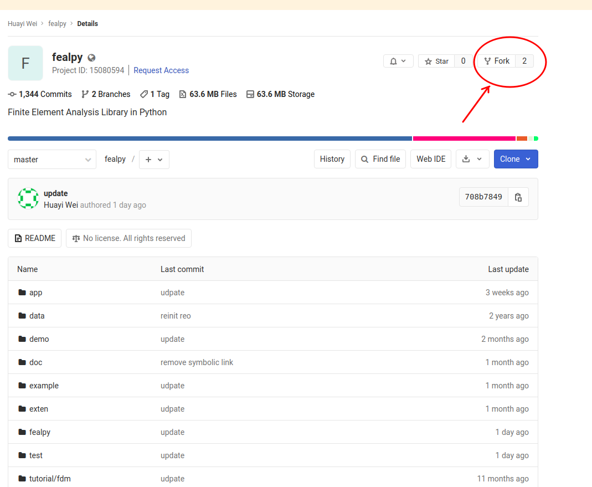
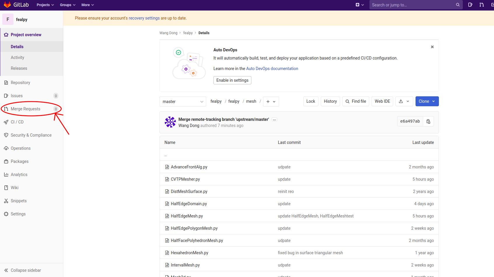
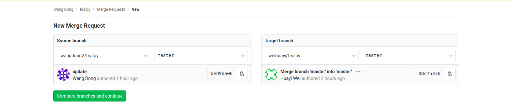

# 基于 Git 的 FEALPy 开发协作


> 一个人力量永远是有限的, 只有协作才能一起强大起来!


## Merge Request 协作流程

下面以 Gitlab 为例介绍 Pull Request 的协作流程:

1. 在 Gitlab 上注册帐户并登录.
2. 打开 [FEALPy](https://gitlab.com/weihuayi/fealpy) 的 Gitlab 页面, 点击右上角
   的 `fork` 按钮, Gitlab 会在你自己的帐户下新建一个 fealpy 同名分支仓库, 其地址
   一般为格式为 `https://gitlab.com/<username>/fealpy`, 注意实际中要把其中的
   `username` 替换为你自 己的帐户名字.
   
3. 利用 `git clone https://gitlab.com/<username>/fealpy` 命令把克隆到本地, 你就可
   以进行自己的开发工作, 并通过 add, pull, merge, push 等操作与自已 Gitlab 帐户
   下的 FEALPy 仓库交互.
4. 如果完成了功能模块的开发, 并测试了程序的正确性, 你就可以准备发起一个 Merge 
   Request 的操作. 在你本地的 `fealpy` 目录下, 执行如下命令
   ```
   $ git remote add upstream https://gitlab.com/weihuayi/fealpy.git
   $ git fetch --all # 拉取自己和管理员仓库中的最新变更
   $ git merge upstream/master origin/master # 合并, 如果不成功, 要重新修改测试自己的代码
   $ git push # 推到自己网上仓库中
   ```
   其中 `git remote add` 的命令执行一次后， 在以后的 merge request 里就不需要.
5. 在 Gitlab 自己的 FEALPy 仓库页面的左边, 点击打开 Merge Requests 页面, 
   
   再点击 右上角的 New merge request, 创建一个新的合并请求, 默认 Source branch
   就是你的 master 分支, Target branch 就是 weihuayi/fealpy 的 master 分支. 在页
   面下面的 Title 和 Description 输入框中填写比较详细修改信息. 最后再点击
   `Submit merge request` 按钮提交即可. 
   
