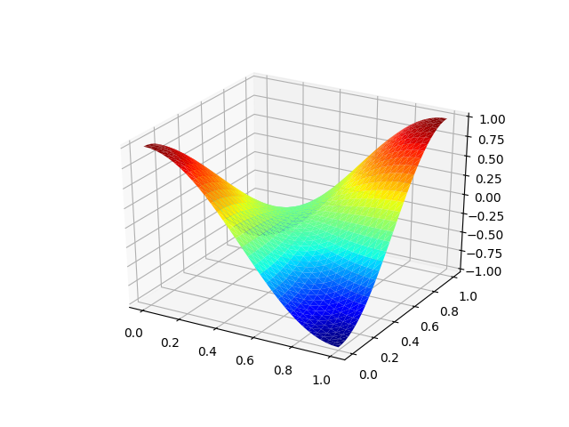

# 基于 FEALPy 的有限元求解 Poisson 方程示例

很抱歉很久没有更新 Python 有限元编程的专栏了，主要原因是又到了评下一级职称的关
头，却突然发现自己没什么能算数的论文，所以只好把非常有限的时间，用于总结成果了
。 再加上头两个月每个星期十二节的课，实在是有点忙不过来。

但一直这样停下去，也会辜负很多人对于 FEALPy 的期待，所以还是硬起头皮，简单写点
我希望和大家分享的东西。下面我想用一系列文章，介绍几类常见方程的算例，让大家对
FEALPy 能做什么有个大概的了解。同时也想得到一些反馈，明确 FEALPy 下一步的改
进方向。关于有限元编程的技巧细节，我会在其它系列的文章中写。


关于 FEALPy 安装请参见前面文章

* [Ubuntu 下的 FEALPy 的安装](https://mp.weixin.qq.com/s?__biz=MzUxNzk0NjExOA==&mid=2247484704&idx=1&sn=064d3c5f41cbc96208071578c9b9a1a1&chksm=f9912b49cee6a25f8370aa9ff338d263dce333ef3fc174c20ac12ce561c25e1227301af471c6&token=162475189&lang=zh_CN#rd)
* [Windows 下的 FEALPy 的安装](https://mp.weixin.qq.com/s?__biz=MzUxNzk0NjExOA==&mid=2247484747&idx=1&sn=e235b752cd12535854fe16000961bf90&chksm=f9912b22cee6a234630f708b75adf94f737a84d85300c9ef13a3388d4a6d47760b1f7e81b760&token=162475189&lang=zh_CN#rd)

## 一个简单的有限元例子

今天介绍最经典的 Poisson 方程的有限元求解过程，考虑如下方程

$$
\begin{cases}
    -\Delta u = f \text{ in } \Omega,\\
    u = g \text{ on } \partial\Omega.
\end{cases}
$$


首先， 导入 pde 模型, 并建立 pde 模型对象

```python
import numpy as np
from fealpy.pde.poisson_2d import CosCosData
pde = CosCosData()
```
其中真解为 $$ u(x, y) = \cos\pi x\cos\pi y $$.

然后，生成三角形网格对象, 初始网格加密 4 次， 网格类型为三角形

```python
mesh = pde.init_mesh(n=4, meshtype='tri')
```

接着，从 fealpy 中导入拉格朗日有限元空间类，在 `mesh` 上建立分片线性连续有限元
空间对象 `space`，并建立一个有限元函数对象 `uh`, 注意这里的 `uh` 同时也是一个数
组对象。

```python
from fealpy.functionspace import LagrangeFiniteElementSpace
space = LagrangeFiniteElementSpace(mesh, p=1)
uh = space.function()
```

从 `space` 对象中，用户可以直接建立刚度矩阵和载荷向量

```python
A = space.stiff_matrix()
b = space.source_vector(pde.source)
```

进一步，导入 Dirichlet 边界条件类，建立相应对象，并处理得到新的线性系统

```python
from fealpy.boundarycondition import DirichletBC
bc = DirichletBC(space, pde.dirichlet)
A, b = bc.apply(A, b)
```

进而导入 Scipy 中的稀疏矩阵求解函数 `spsolve` 求解得到有限元解。

```python
from scipy.sparse.linalg import spsolve
uh[:] = spsolve(A, b)
```

下面就可以进行误差分析, 并把误差结果显示出来

```python
uI = space.interpolation(pde.solution)
e = uh - uI
l2 = np.sqrt(np.mean(e**2))

L2 = space.integralalg.L2_error(pde.solution, uh)
H1 = space.integralalg.L2_error(pde.gradient, uh.grad_value)

print({'l_2 error': l2, 'L_2 error': L2, 'H_1 error': H1})
```

也可以把解给画出来

```python
import matplotlib.pyplot as plt
uh.add_plot(plt)
plt.show()
```

最终得到的解图像如下图



## 总结

上面的过程基本涵盖了有限元求解的基本过程，但还有很多不完善的地方。其中一个是边
界条件处理， 如第二类和第三类边界条件的处理还没有加进去，主要原因是在软件设计上
，我还没有想清楚怎么组织代码更自然。 一个初步的想法是， pde 对象自己负责把边界
类型标记写入 mesh 对象，然后 space 对象根据 mesh 中的边界类型标记，为边界条件对
象处理边界提供必要的信息。 

FEALPy 在设计中只是规定了各种 pde 对象的接口，而不关心 pde 对象的实现，因为具体
要求解什么样的 pde，包括定义域，源项，系数，边界条件等已知数据，只有用户自己知
道，所以用户有责任来提供这些信息。

另外，FEALPy 中离散系统求解部分还很不完善。上面的例子中，用的是直接方法，用户还
可以安装 pyamg 模块来快速求解离散系统。陈老师的 IFEM 在求解器方面做的很好，未来
我会尽快把相应的程序移植过来。

想做和需要做的事情很多，但一个人的精力总是有限的，再加上自我时间管理不够系统，
导致很多事情没有能够及时做好，希望能够被理解和原谅吧。最近小熊老师在学习时间管
理， 希望在小熊老师的亲自指导下，把自己的时间管理做好，从而能够更好满足自己，还
有大家对我的期待吧。


